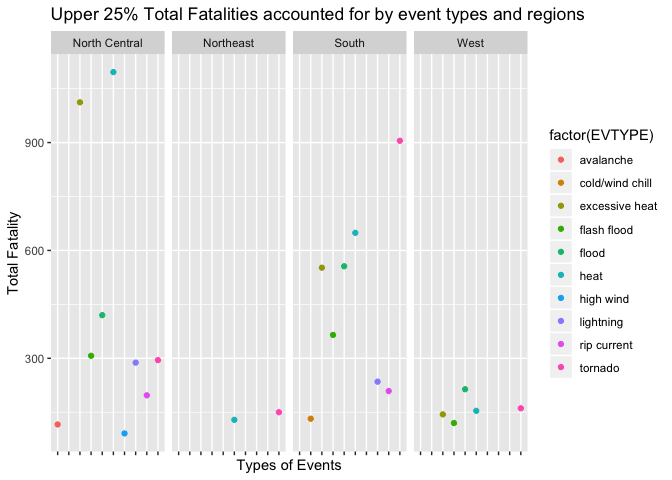
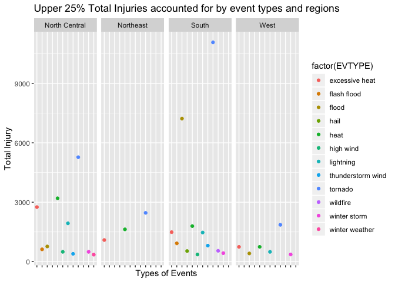
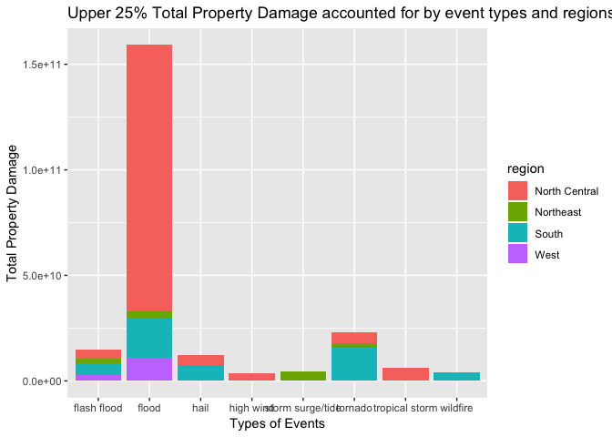

## Synopsis

In this report we want to identify the most harmful event to population health and economics in respect to property damage since 1996 when all types of events were recorded. Particularly, we look at events that account for the upper 25% total harmful consequences aross US regions (North Central, Northeast, South and West). North Central and South show higher total fatalities accounted for by heat, exessive heat and tornado. South shows higher total injuries accounted for by tornado and flood. Flood accounts for the most property damage, especially in the North Central region.


## Data Loading and Processing 

Read in the data from U.S. National Oceanic and Atmospheric Administration's (NOAA) storm database.


```r
download.file('https://d396qusza40orc.cloudfront.net/repdata%2Fdata%2FStormData.csv.bz2',destfile = 'stormdata.csv')
stormdata<-read.csv('stormdata.csv', sep = ',', header = TRUE)
```

We only look at data recorded after January 1996 because not all event types were recorded before 1996.

```r
data1<-transform(stormdata, BGN_DATE=strptime(BGN_DATE,'%m/%d/%Y'))
subset1<-subset(data1, BGN_DATE >= '1996-01-01')
```


Seperate US state data from US territory data.

```r
statestorm<-subset(subset1, STATE %in% state.abb)
statestorm$BGN_DATE<-as.POSIXct(statestorm$BGN_DATE)
```


Add region variable to the dataset and subset useful variables to investigae health impact. Subset varibles for data analysis.

```r
library(dplyr)
```

```
## 
## Attaching package: 'dplyr'
```

```
## The following objects are masked from 'package:stats':
## 
##     filter, lag
```

```
## The following objects are masked from 'package:base':
## 
##     intersect, setdiff, setequal, union
```

```r
statestorm %>% group_by(STATE)
```

```
## # A tibble: 634,826 x 37
## # Groups:   STATE [50]
##    STATE__ BGN_DATE            BGN_TIME TIME_ZONE COUNTY COUNTYNAME STATE
##  *   <dbl> <dttm>              <fct>    <fct>      <dbl> <fct>      <fct>
##  1       1 1996-01-06 00:00:00 08:00:0… CST            1 ALZ001>038 AL   
##  2       1 1996-01-11 00:00:00 06:35:0… CST           31 COFFEE     AL   
##  3       1 1996-01-11 00:00:00 06:45:0… CST           31 COFFEE     AL   
##  4       1 1996-01-11 00:00:00 07:05:0… CST           45 DALE       AL   
##  5       1 1996-01-11 00:00:00 07:38:0… CST           67 HENRY      AL   
##  6       1 1996-01-18 00:00:00 05:05:0… CST          125 TUSCALOOSA AL   
##  7       1 1996-01-18 00:00:00 06:00:0… CST            1 ALZ001>01… AL   
##  8       1 1996-01-19 00:00:00 12:20:0… CST           75 LAMAR      AL   
##  9       1 1996-01-24 00:00:00 03:40:0… CST           51 ELMORE     AL   
## 10       1 1996-01-24 00:00:00 03:45:0… CST          101 MONTGOMERY AL   
## # … with 634,816 more rows, and 30 more variables: EVTYPE <fct>,
## #   BGN_RANGE <dbl>, BGN_AZI <fct>, BGN_LOCATI <fct>, END_DATE <fct>,
## #   END_TIME <fct>, COUNTY_END <dbl>, COUNTYENDN <lgl>, END_RANGE <dbl>,
## #   END_AZI <fct>, END_LOCATI <fct>, LENGTH <dbl>, WIDTH <dbl>, F <int>,
## #   MAG <dbl>, FATALITIES <dbl>, INJURIES <dbl>, PROPDMG <dbl>,
## #   PROPDMGEXP <fct>, CROPDMG <dbl>, CROPDMGEXP <fct>, WFO <fct>,
## #   STATEOFFIC <fct>, ZONENAMES <fct>, LATITUDE <dbl>, LONGITUDE <dbl>,
## #   LATITUDE_E <dbl>, LONGITUDE_ <dbl>, REMARKS <fct>, REFNUM <dbl>
```

```r
region<-character()
for ( i in 1:50) {
        substate<-subset(statestorm, STATE==state.abb[[i]])
        r<-as.character(state.region[[i]])
        region<-c(region,rep(r,times=nrow(substate)))
}
statestorm$region<-region
table(statestorm$region)
```

```
## 
## North Central     Northeast         South          West 
##        233208         54803        270591         76224
```

```r
statestorm1<-statestorm[,c('BGN_DATE','EVTYPE','FATALITIES','INJURIES','region')]
```
 

Clean EVTYPE variable. Recorded events with typos are mapped based on the official list of events in the Storm Data Event Table in the Storm Data Documentation.

```r
library(lubridate)
```

```
## 
## Attaching package: 'lubridate'
```

```
## The following object is masked from 'package:base':
## 
##     date
```

```r
library(dplyr)
```

```
## 
## Attaching package: 'dplyr'
```

```
## The following objects are masked from 'package:lubridate':
## 
##     intersect, setdiff, union
```

```
## The following objects are masked from 'package:stats':
## 
##     filter, lag
```

```
## The following objects are masked from 'package:base':
## 
##     intersect, setdiff, setequal, union
```

```r
statestorm2<-statestorm1 %>% group_by(year(BGN_DATE),region,EVTYPE)%>%summarise(sum(FATALITIES),sum(INJURIES))
statestorm2$EVTYPE<-tolower(statestorm2$EVTYPE)
type<-c('Astronomical Low Tide' , 'Avalanche',  'Blizzard','Coastal Flood','Cold/Wind Chill','Debris Flow','Dense Fog', 'Dense Smoke', 'Drought' ,'Dust Devil','Dust Storm', 'Excessive Heat',  'Extreme Cold/Wind Chill',  'Flash Flood',  'Flood',  'Frost/Freeze', 'Funnel Cloud',  'Freezing Fog',  'Hail', 'Heat', 'Heavy Rain',  'Heavy Snow',  'High Surf',  'High Wind', 'Hurricane (Typhoon)', 'Ice Storm', 'Lake-Effect Snow', 'Lakeshore Flood', 'Lightning', 'Marine Hail','Marine High Wind', 'Marine Strong Wind', 'Marine Thunderstorm Wind','Rip Current', 'Seiche','Sleet','Storm Surge/Tide', 'Strong Wind', 'Thunderstorm Wind', 'Tornado','Tropical Depression', 'Tropical Storm','Tsunami', 'Volcanic Ash',' Waterspout','Wildfire','Winter Storm','Winter Weather') # official event types from storm data event table
type<-tolower(type)
event<-data.frame()
for (i in type) {
        i<-as.character(i)
        a<-statestorm2[grep(i,statestorm2$EVTYPE,fixed = FALSE),]
        a$EVTYPE<-rep(i,times=nrow(a))
        event<-rbind.data.frame(event,a)
}
```


Calculate total fatalities and injuries across regions and event types, and extract the top 25% for fatalities and injuries.

```r
fatalityregiontype<-event %>% group_by(region,EVTYPE) %>% summarise(TotalFatality=sum(`sum(FATALITIES)`)) %>% arrange(desc(TotalFatality))
injuryregiontype<-event %>% group_by(region,EVTYPE) %>% summarise(TotalInjury=sum(`sum(INJURIES)`)) %>% arrange(desc(TotalInjury))
qtfatality<-quantile(fatalityregiontype$TotalFatality) # cutoff for upper 25% is 88.5
qtinjury<-quantile(injuryregiontype$TotalInjury) # cutoff for upper 25% is 344.5
upperfatality<-subset(fatalityregiontype, TotalFatality >= 88.5)
upperinjury<-subset(injuryregiontype, TotalInjury >= 344.5)
```


## Results

**Across the United States, excluding US territories.**

To identify types of events that are most harmful to population health, we aggregate the total counts of fatality and injury cases across regions and event types, and plot the types of events that account for the top 25% of the total fatalites and injuries.


```r
library(ggplot2)
g<-ggplot(data = upperfatality,aes(x=EVTYPE,y=TotalFatality,color=factor(EVTYPE)))
g+geom_point()+facet_grid(.~region)+labs(x= 'Types of Events', y = 'Total Fatality', title = 'Upper 25% Total Fatalities accounted for by event types and regions')+theme(axis.text.x=element_blank())
```

<!-- -->

Now we create a similar plot to identify events that cause the most total injuries across US regions.

```r
g<-ggplot(data = upperinjury,aes(x=EVTYPE,y=TotalInjury,color=factor(EVTYPE)))
g+geom_point()+facet_grid(.~region)+labs(x= 'Types of Events', y = 'Total Injury', title = 'Upper 25% Total Injuries accounted for by event types and regions')+theme(axis.text.x=element_blank())
```

<!-- -->


Now that we know what types of events are most harmful with respect to population health, we want to investigae the impacts on economics in respect to property damage as well. First we want to calculate the property damage in dollar amounts and aggregate that amount based on types of events.

```r
statestorm3<-statestorm[,c('BGN_DATE','EVTYPE','PROPDMG','PROPDMGEXP','region')]
statestormK<-statestorm3 %>% filter(PROPDMGEXP %in% c('K','k')) %>% mutate(multiplier=1000, PropDmgAmount=PROPDMG*multiplier)
statestormM<-statestorm3 %>% filter(PROPDMGEXP %in% c('M','m')) %>% mutate(multiplier=1000000,PropDmgAmount=PROPDMG*multiplier)
statestormB<-statestorm3 %>% filter(PROPDMGEXP %in% c('B','b')) %>% mutate(multiplier=1000000000,PropDmgAmount=PROPDMG*multiplier)
property<-rbind(statestormK,statestormM,statestormB)
property1<-property %>% group_by(EVTYPE,region)%>%summarise(sum(PropDmgAmount))
```

Now we want to clean up the event types in a similar fashion and extract the upper 25% for property damage amounts.

```r
property1$EVTYPE<-tolower(property1$EVTYPE)
event1<-data.frame()
for (i in type) {
        i<-as.character(i)
        a<-property1[grep(i,property1$EVTYPE,fixed = FALSE),]
        a$EVTYPE<-rep(i,times=nrow(a))
        event1<-rbind.data.frame(event1,a)
}
property2<-event1 %>% group_by(EVTYPE,region) %>% summarise(TotalDamage=sum(`sum(PropDmgAmount)`)) %>% arrange(desc(TotalDamage))
qtproperty<-quantile(property2$TotalDamage) # utoff for upper 25% percentile is 1994876595 
upperproperty<-subset(property2, TotalDamage >= 1994876595 )
```

To identify the types of events that cause the most property damange from since 1996, we can create a bar plot.

```r
g<-ggplot(upperproperty,aes(x=EVTYPE))
g+geom_bar(aes(weight=TotalDamage,fill=region))+labs(x= 'Types of Events', y = 'Total Property Damage', title = 'Upper 25% Total Property Damage accounted for by event types and regions since 1996')
```

<!-- -->

